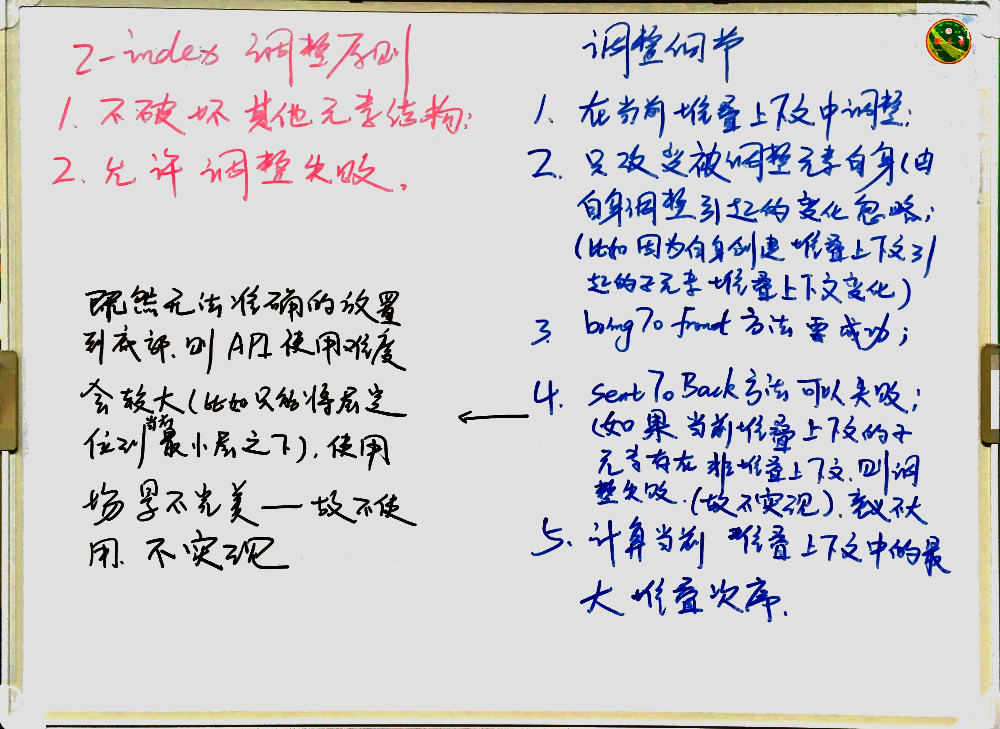

# jenga修改分析

> jenga原版的代码中对z-index的操作会对页面中其他元素带来一定的副作用，故对其做适当修改，具体原因如下文分析。

## z-index属性修改原则
1. 不破坏其他元素结构、样式和属性；
2. 允许调整失败，调整失败后业务使用方调整代码。

## 调整细节
1. 在当前堆叠上下文中修改；
2. 只改变被调整元素自身的属性，忽略由于自身调整引起的变化，比如：因为元素自身创建堆叠上下文引起子元素堆叠上下文变化而引起的视觉变化；
3. bringToFront在元素所处的堆叠上下文中调整；
4. 删除sendToBack方法；
5. 计算当前堆叠上下文中后代元素的最大堆叠次序。

## 删除sendToBack方法原因
sendToBack方法的调用在上述z-index属性修改原则的约束下可能失败（如果当前堆叠上下文的后代元素中存在非堆叠上下文，则调整失败），既然无法准确的将其放置到底部，只能将层定位到当前最小堆叠次序之下，使用场景不确定，执行结果不确定，造成API使用难度较大，则实现意义不大，故删除该方法。

